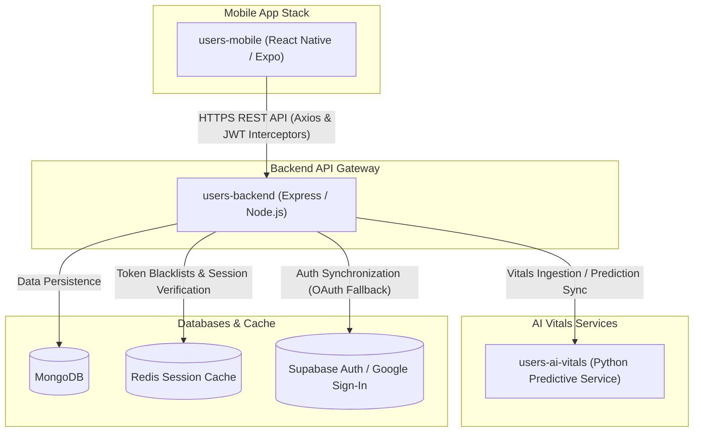

# CareMyMed / CareConnect Architecture Documentation

Welcome to the **CareMyMed / CareConnect** technical architecture guides. This directory contains detailed descriptions and industry-level flowcharts explaining the core components, integration pipelines, and data flows of the repository.

These guides are written to help developers, care managers, and engineers quickly understand the technical systems powering our healthcare management platform.

## Architecture Guides and Flowcharts

Select a guide below to explore the detailed pipeline details, system interactions, and flowcharts:

| Document / Area | Key Topics Covered |
|:---|:---|
| 🎨 [Interactive Flow.io Data Pipeline Diagram](file:///c:/dev/CareCoUsers/docs/architecture/interactive_data_flow.html) | A high-fidelity, interactive dark-themed SVG/HTML flowchart displaying how patient inputs (vitals, sleep, meds) synchronize to the Express gateway, BullMQ queue, Personal Baseline Z-Score mathematics, and Streak UI. Allows filtering individual paths directly in the browser. |
| 🔐 [Authentication Architecture](file:///c:/dev/CareCoUsers/docs/architecture/authentication_flow.md) | Dual-Token System (CareMyMed JWT + Supabase Auth fallback), session verification, and client/server interception logic. |
| 📊 [AI Health Scoring & Personal Baselines](file:///c:/dev/CareCoUsers/docs/architecture/health_scoring_pipeline.md) | The daily health score computation, rolling Z-scores, anomaly detection engine, and database snapshot/caching cycles. |
| 💤 [4-Tier Sleep Estimation Pipeline](file:///c:/dev/CareCoUsers/docs/architecture/sleep_estimation_engine.md) | Smartwatch/Fitness Tracker querying (Health Connect), Android screen-off activity stats (`UsageStatsManager`), manual logger, and permission/CTA fallbacks. |
| 🔄 [Offline Syncing & Cached Data Strategy](file:///c:/dev/CareCoUsers/docs/architecture/offline_sync_and_cache.md) | Zustand app state sync, offline mutation queues (AsyncStorage queue), token refresh safety, and Encrypted Storage for sensitive health metrics. |

---

## Monorepo Overview

CareMyMed uses a monorepo structure to isolate frontend interfaces from backend APIs while sharing data models and integration pipelines:

---

## System Design Guidelines

When developing in this repository, follow these core conventions:
1. **Touch-First UI Constraints**: All clickable components and touch items in the mobile client (`users-mobile`) must respect a minimum touch target area of **44pt x 44pt** (iOS) and **48dp x 48dp** (Android) using properties like `hitSlop` to prevent tap misses on compact grids (e.g. the 35-day Streak Calendar).
2. **Offline Resilience**: All critical user writes (vitals logging, mood checks, medication logs) must be pushed through `OfflineSyncService` to queue writes locally in AsyncStorage during network drops, ensuring high reliability in clinical/patient settings.
3. **Harmonious Visual Systems**: Do not use raw primary saturated gradients. Stack clean, layered colors and use high-end overlays (like sapphire-indigo meshes) to maintain visual trust, accessibility, and high visual craft.
