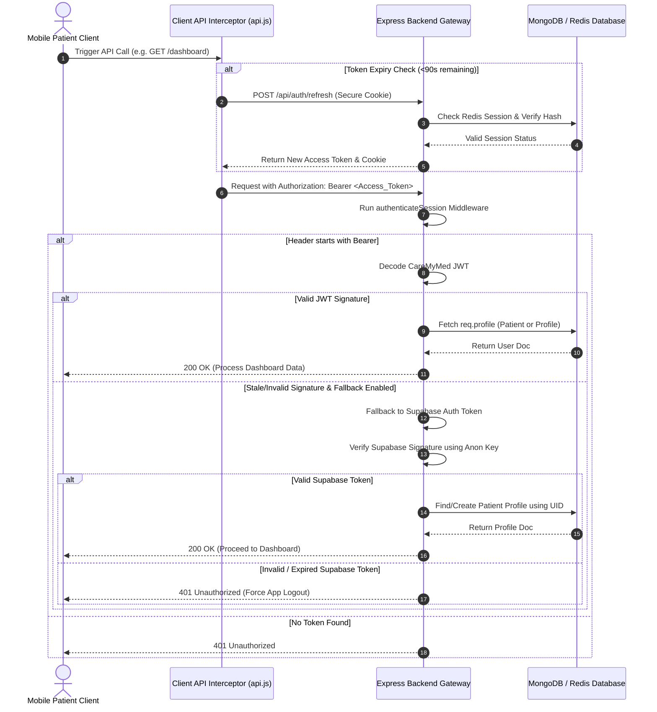
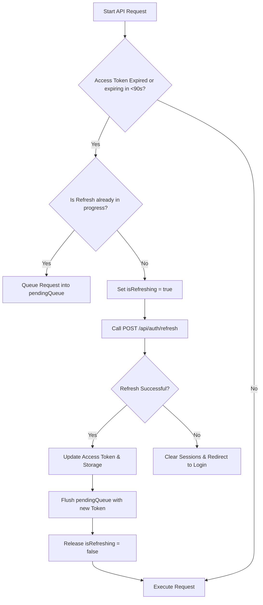

# 🔐 Authentication Flow Architecture

CareMyMed uses a high-security, **dual-token architecture** designed to support both native high-performance JWT verification and external OAuth providers (specifically Supabase Auth/Google Sign-In) to manage patient and provider profiles.

---

## Technical Overview

The authentication pipeline coordinates client-side request interceptors (`users-mobile/src/lib/api.js`) and backend token middlewares (`users-backend/src/middleware/authenticate.js`).

1. **CareMyMed JWT (Primary)**:
   * **Access Token**: Short-lived (15 minutes), signed with `JWT_ACCESS_SECRET`, passed in the HTTP `Authorization: Bearer <token>` header. Contains user profiles, organization limits, and user type (`patient` or `staff`).
   * **Refresh Token**: Opaque, long-lived token stored hashed in MongoDB and cached in Redis. Accessed via a secure HTTP-only cookie.
2. **Supabase Auth (Fallback/Legacy)**:
   * Used as an OAuth wrapper for Google Sign-In on mobile devices.
   * If `AUTH_ENABLE_SUPABASE_FALLBACK=true`, the backend decodes the Supabase token to match or automatically migrate patient profiles inside our MongoDB.

---

## Authentication Sequence Flowchart

The diagram below details the auth workflow from client requests to backend middleware resolution:

---

## Client-Side Request Interceptor Details

To prevent race conditions during simultaneous API calls when a token expires, the client-side `api.js` Axios instance queues outgoing requests during refresh cycles:

---

## Security Implementation Rules

1. **Token Storage**: On mobile clients, all sensitive tokens and refresh keys must be written to `expo-secure-store` or `react-native-encrypted-storage` rather than raw `AsyncStorage` to prevent reverse-engineering extraction.
2. **Session Validity Checks**: The backend enforces `tokenService.checkRedisSessionValidity` on every request to immediately invalidate compromised sessions upon logout or credential reset.
