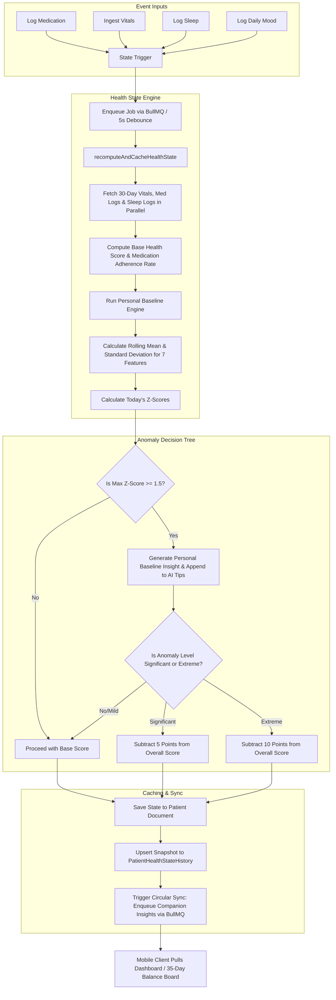

# 📊 AI Health Scoring & Personal Baselines

The Daily Health Score is a holistic metric reflecting patient wellness, combining medication adherence, vitals consistency, sleep quality, and daily mood tracking.

---

## Processing Cycle Flowchart

The workflow below outlines how the system schedules, computes, and caches a patient's daily health score and checks for anomalies:

---

## 30-Day Personal Baseline Features

The baseline engine (`personalBaselineService.js`) calculates rolling standard deviations over a 30-day baseline window:

$$\mu = \frac{1}{N} \sum_{i=1}^N x_i, \quad \sigma = \sqrt{\frac{1}{N} \sum_{i=1}^N (x_i - \mu)^2}$$

$$Z = \frac{x_{\text{today}} - \mu}{\sigma}$$

The features tracked include:
1. **Systolic Blood Pressure** (Vitals Log)
2. **Diastolic Blood Pressure** (Vitals Log)
3. **Heart Rate** (Vitals Log)
4. **Oxygen Saturation / SpO2** (Vitals Log)
5. **Sleep Hours** (Sleep Log)
6. **Mood Score** (Sad = 1, Okay = 2, Good = 3, Great = 4)
7. **Medication Adherence** (daily percentages)

---

## Score Deduplication and Caching

* **Deduplication**: When multiple updates occur (e.g. logging 3 medications in 10 seconds), BullMQ schedules the job with a unique ID `health-state-<patientId>` and a **5-second delay**. This prevents redundant backend CPU cycles.
* **Cache Expiry**: The patient's `patient_health_state` holds a `computed_at` timestamp. Frontend calls to `/me/health-state` return the cached state instantly if it is **less than 30 minutes old**. If older, it triggers a synchronous recomputation.
* **Daily History Backfilling**: When a new patient requests history and has fewer than 30 entries, the service backfills the past 30 days. Unlogged metrics are recorded as `null`, rendering them as grey (no data) on the calendar instead of triggering false alarm colors.
