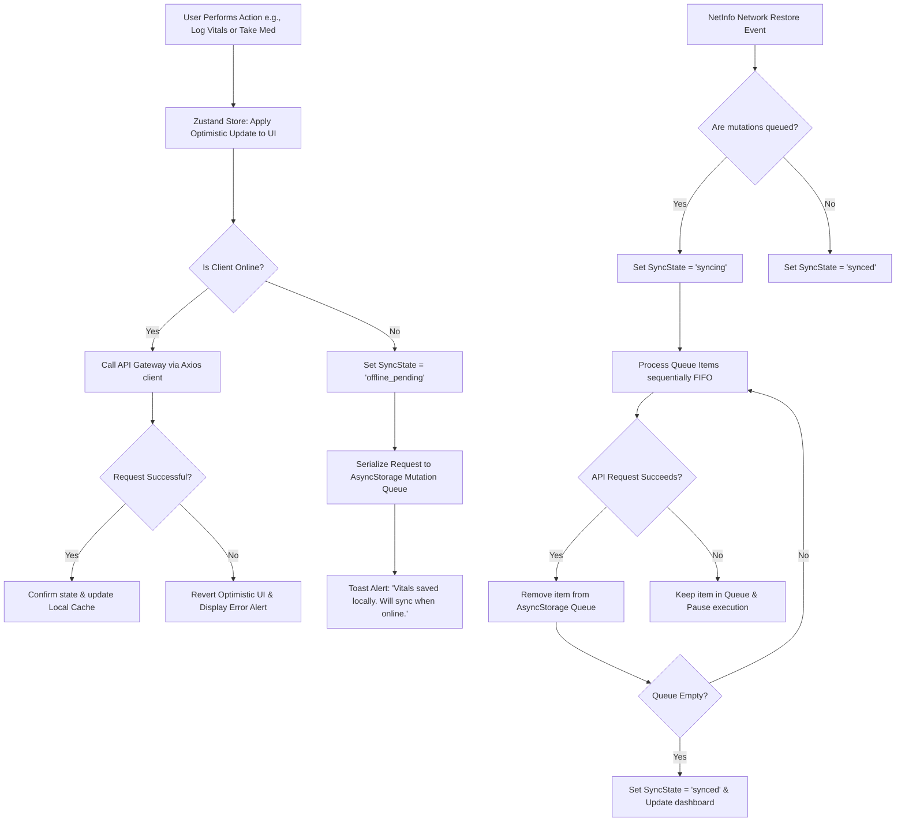

# 🔄 Offline Syncing & Cached Data Strategy

CareMyMed is designed to operate seamlessly in locations with unstable network coverage (e.g., hospitals, senior living facilities, transit). 

---

## Data Synchronization Flow

The mobile client leverages an optimistic UI pattern alongside a robust offline queuing mechanism to ensure zero clinical data loss:

---

## Client Caching Strategy

The mobile application operates on a layered, secure caching system to manage performance and preserve patient privacy:

| Cache Key | Storage Mechanism | Security Level | Purpose |
|:---|:---|:---|:---|
| `medication_call_preferences` | `AsyncStorage` | Low | UI rendering & settings defaults |
| `health_profile` | `react-native-encrypted-storage` | High | Diagnostic history, clinical conditions |
| `medications_today` | `react-native-encrypted-storage` | High | Specific daily medication details |
| `patient_data` | `react-native-encrypted-storage` | High | Patient identity, address, phone number |
| `auth_session` | `expo-secure-store` | Maximum (OS Keychain) | JWT access keys, refresh tokens, user UIDs |

---

## Key Offline & Cache Implementations

1. **FIFO Mutation Queue**: Updates are logged sequentially. If one request fails due to a validation error, it is flagged, and the queue processing pauses to prevent out-of-order execution bugs.
2. **Encrypted Storage Isolation**: When sensitive health data is fetched, the keys are prefixed by the current user's UID. This prevents data leakage on shared/family tablets, as switching accounts immediately hides key records.
3. **Screen Capture Protections**: If the patient's profile has `allow_screenshots: false` enabled, the app utilizes native flag controllers (`FLAG_SECURE` on Android) to block screen captures and show a privacy overlay when the app transitions to the background.
