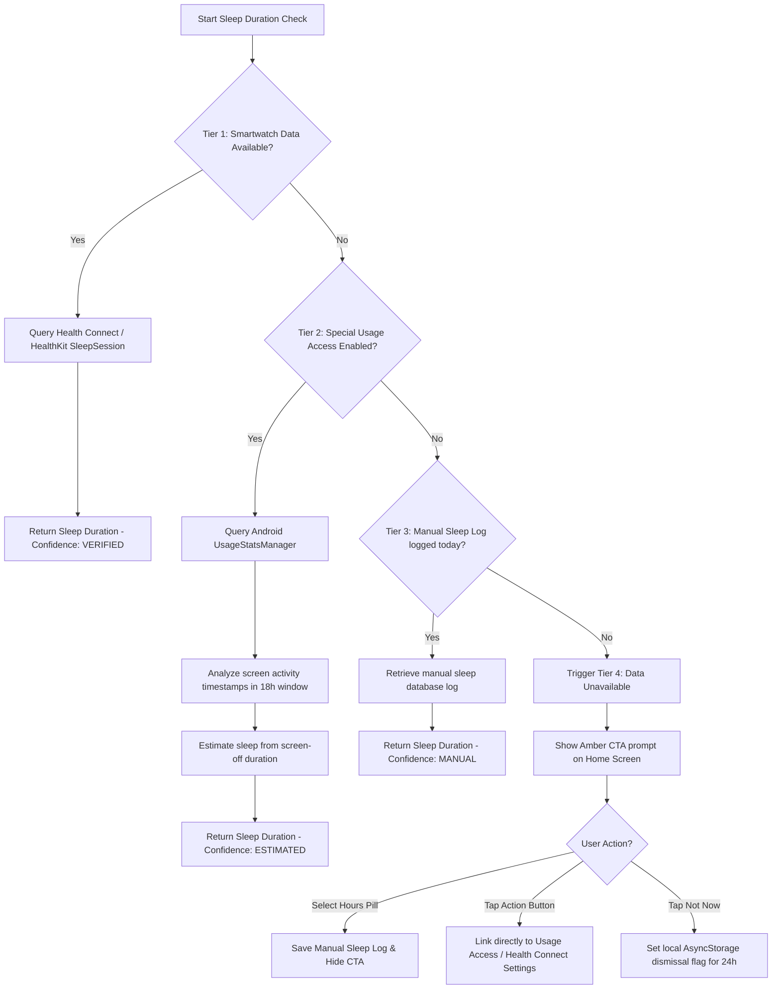

# 💤 4-Tier Sleep Estimation Pipeline

CareMyMed utilizes a multi-tiered sleep estimation strategy to provide qualitative confidence levels and transparent sleep metrics to the user.

---

## The 4 Sleep Query Tiers

To balance accuracy, battery consumption, and privacy, sleep duration is queried sequentially through the following fallback hierarchy:

---

## Detailed Logic Explanations

### Tier 1 — Health Connect & HealthKit
* **Description**: Queries native OS sleep frameworks.
* **Mechanism**: On Android, retrieves standard `SleepSessionRecord` data from the local Health Connect client. On iOS, retrieves equivalent records from HealthKit.
* **Precision**: Very High (based on wearable biometrics: heart rate variability, motion).

### Tier 2 — Usage Stats (`UsageStatsManager`)
* **Description**: Incurs zero hardware requirements by calculating screen-off idle time.
* **Mechanism**: Fetches foreground system activity events between 4:00 PM yesterday and 12:00 PM today. Finds the **last user screen interaction** at night ($T_{\text{last}}$) and the **first screen interaction** in the morning ($T_{\text{first}}$).
* **Calculation**:
  $$\text{Sleep Duration} = T_{\text{first}} - T_{\text{last}}$$
* **Precision**: High (typically within 30-40 minutes of actual sleep, far superior to checking when the CareMyMed app itself was last opened).

### Tier 3 — Manual Logging
* **Description**: Respects user self-reports.
* **Mechanism**: Ingests direct logs via manual inputs from the bottom sheets or screens.

### Tier 4 — Amber CTA Fallback
* **Description**: Prompts users to unlock higher tracking accuracy.
* **Mechanism**: Displays a premium warm Amber card on the main dashboard urging the user to either authorize Health Connect or grant the `PACKAGE_USAGE_STATS` settings permission, with a clean option to dismiss.
